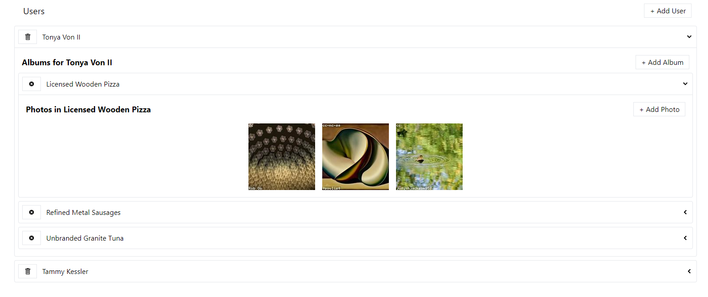

# Introduction

This javascript application aims to exercise React and Redux skills with an emphasis in using [async thunks](https://redux-toolkit.js.org/api/createAsyncThunk) and 
[Redux toolkit (RTK) query](https://redux-toolkit.js.org/rtk-query/overview#:~:text=RTK%20Query%20is%20a%20powerful,data%20fetching%20%26%20caching%20logic%20yourself.)
for fetching and caching test data. Both methods are used for data loading in different parts of the web application. The purpose of 
using both of them is for learning.  The data used throughout of this app is randomly generated using [faker](https://fakerjs.dev/) library.
Below, there are instructions to set-up and launch the app as well as implementation remarks are given for developers.


The following packages have been used:

* [Redux toolkit](https://redux-toolkit.js.org/) for working with Redux. This is a wrapper for Redux. The main usage of this package
is regarding redux toolkit (RTK) query for efficient data fetching and caching. 
* [React-Redux](https://react-redux.js.org/) package that allows react components to interact with the redux store.
* [Json server](https://www.npmjs.com/package/json-server) package that is used to persist the data in the form of json. It is used for development and testing purposes
* [Axios](https://www.npmjs.com/package/axios) package for HTTP requests.
* [Faker-js](https://www.npmjs.com/package/@faker-js/faker) for generating random data.
* [ClassNames](https://www.npmjs.com/package/classnames) utility for joining classNames together.
* [Tailwind css](https://tailwindcss.com/) for styling the React components.

## Purpose
This web application is used to display a list of users, a list of albums for every user and a list of photos for every of
the created albums. There is the ability to create and remove users/albums/photos. Every user and its albums are displayed
using expandable panels. During the loading of users and albums a tailwind css animation is displayed to the user. The delete
functionality of photos is overlayed in the image, i.e. when a user hovers over a photo, the delete button is shown overlayed 
on the photo.



## Set-up and usage

After cloning the github repository, change to the project folder and run:

```bash
npm install
```
to install all the necessary packages listed at **package.json** file. The next step is to run the json server:

```bash
npm run start:server
```
and then the development server:
```bash
npm run start
```
The last command opens a new tab in the default browser using the [http://localhost:3000/](http://localhost:3000/) url.

## Styling set-up (taiwind css)

[Tailwindcss](https://tailwindcss.com/) is a css library that has been used to style the application components (buttons, expandable panels etc).
Installation instructions are given [here](https://tailwindcss.com/docs/installation).

## Implementation remarks
1. Data is fetched in a lazy fashion when is needed. For example when the list of albums for a particular user is displayed only
these albums are fetched and not the albums for all the users.
2. Async thunks have been used to implement
data fetching/creation/deletion of users (look the use of `createAsyncThunk()` method in `addUser.js`, `fetchUsers.js`, `removeUser.js` ) while RTK query
is used to perform fetching/creation/deletion of albums and photos (look at `albumsApi.js` and `photosApi.js` files).
3. RTK query supports the creation of tags that can be invalidated when a POST or DELETE requests are performed. As a result of this invalidation
a GET request is performed to fetch the up-to-date list of albums/photos and render them. (For more details see `albumsApi.js`, `photosApi.js`)
3. The white-grey gradient that is shown has been implemented in `Skeleton.js` component and is configured in `tailwind.config.js` file.
4. There is a manually introduced time pause to test the skeleton component when the fetching of data (users/albums) is performed (GET request):

```javascript
const fetchUsers = createAsyncThunk('users/fetch', async () => {
    const response = await axios.get('http://localhost:3005/users');
    await pause(1000);
    return response.data;
});
```


